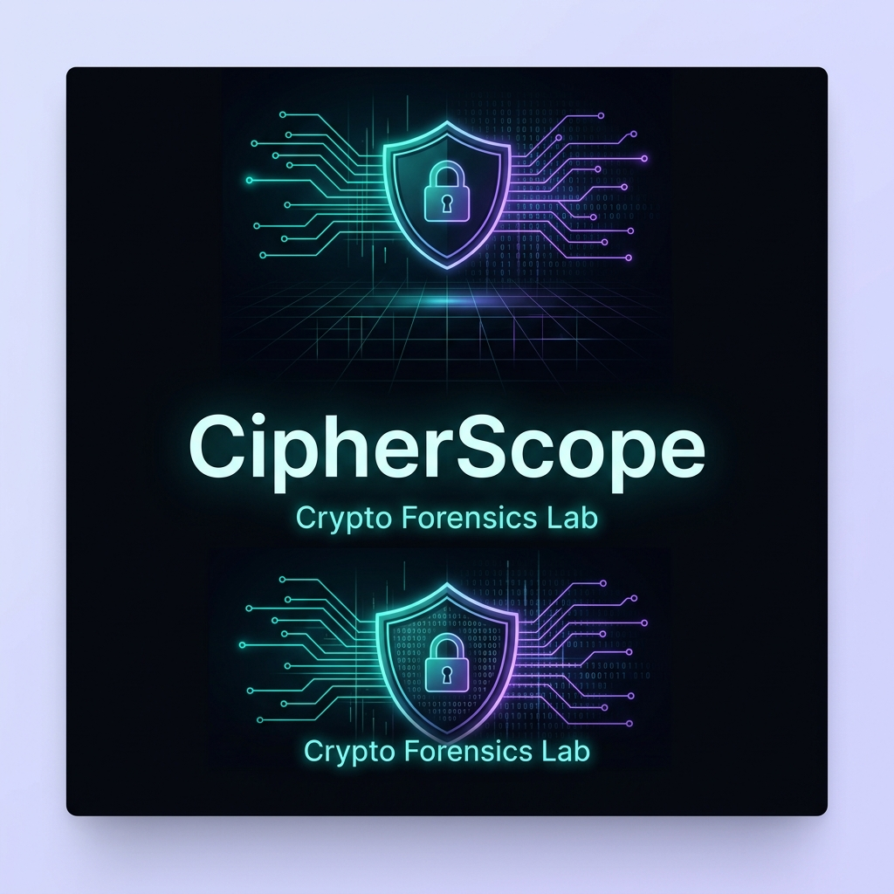

# CipherScope — Crypto Forensics Lab 🔐

CipherScope is a state-of-the-art hybrid cryptographic workspace and AI-driven forensics lab. It combines high-performance hybrid encryption (RSA + AES) with cutting-edge real-time AI security assessments to provide a zero-trust, mathematically robust cryptographic pipeline. 

Designed with a sleek, dark-themed interface, CipherScope offers professionals an intuitive environment to encrypt payloads, analyze cryptographic configurations, evaluate vulnerabilities, and seamlessly track performance metrics through dynamic data visualizations.

---

## 🌟 Key Features

1. **Operation Lab (Hybrid RSA-AES Pipeline)**
   - Upload text, JSON, CSV, or PDF documents, or type raw plaintext directly into the workspace.
   - Execute secure Hybrid Encryption: Uses **AES-256-GCM** for high-speed payload encryption, and **RSA-2048-OAEP** to securely wrap and transmit the AES session key.
   - Robust local caching ensures your workspace (keys, plaintext, and ciphertext) persists across navigations without unexpected resets.

2. **AI Document & Key Analysis Engine**
   - Connects directly to the **CipherScope Backend** running a FastAPI server powered by Llama 3 (via Groq/Ollama).
   - Generates dynamic, context-aware security assessments. It analyzes your chosen encryption parameters (e.g., key sizes, modes) and generates a realistic **Security Score (0-100)**.
   - Provides actionable feedback and flags potential vulnerabilities in your cryptographic setup.

3. **Hybrid Lab Playground**
   - A step-by-step visual learning environment for manual payload decryption.
   - Select keys generated in the Operation Lab, decrypt the AES session key using your private RSA key, and finally unlock the ciphertext payload.

4. **Security Operations Dashboard**
   - Live, real-time analytics displaying all historical reports.
   - Evaluates security posture with aggregated metrics, tracking vulnerabilities, file sizes, average security scores, and document patterns.
   - Fully synchronized with Supabase for cloud-scale, zero-trust telemetry.

5. **Key Vault**
   - Persistent management of all RSA and AES keys generated within the platform.
   - Tracks the lifecycle of keys, alongside the documents and metadata they are associated with.

---

## 🛠️ Architecture & Tech Stack

- **Frontend:** Next.js 16 (App Router), React 19, TypeScript
- **Styling:** Tailwind CSS (v4), Framer Motion, shadcn/ui components
- **State & Data:** Supabase (PostgreSQL with RLS), LocalStorage Caching, Clerk Authentication
- **Backend Analytics Engine:** Python, FastAPI, Pydantic, Groq API (Llama-3-70b), ChromaDB
- **Package Manager & Runtime:** `bun`

---

## 🚀 Getting Started

### Prerequisites

Ensure you have the following installed on your machine:
- [Bun](https://bun.sh/) (JavaScript runtime and package manager)
- [Python 3.10+](https://www.python.org/) (For the AI backend agent)
- A [Supabase](https://supabase.com/) project (with `reports`, `cryptographic_keys_v2`, etc. tables configured)
- A [Clerk](https://clerk.com/) account for authentication

### 1. Environment Setup

Copy the `.env.example` file to create your local `.env` (if applicable), or configure your `.env` manually:
```bash
cp .env.example .env
```
Ensure you fill in your Supabase, Clerk, and Groq API keys:
```env
NEXT_PUBLIC_CLERK_PUBLISHABLE_KEY=pk_test_...
CLERK_SECRET_KEY=sk_test_...
NEXT_PUBLIC_SUPABASE_URL=https://your-project.supabase.co
NEXT_PUBLIC_SUPABASE_ANON_KEY=your-anon-key
GROQ_API_KEY=gsk_...
```

### 2. Install Frontend Dependencies

Using `bun`, install the Node modules:
```bash
bun install
```

### 3. Setup Python Backend Environment

Navigate to the `backend/` directory, set up your virtual environment, and install dependencies:
```bash
cd backend
python3 -m venv venv
source venv/bin/activate
pip install -r requirements.txt
cd ..
```

### 4. Run the Full Application

We've bundled the execution into a single command that starts both the Next.js frontend and the Uvicorn FastAPI backend concurrently. The `dev` script is pre-configured to activate your Python environment automatically!

Start the development server:
```bash
bun run dev
```

The frontend will be available at `http://localhost:3000` and the backend at `http://localhost:8000`.

---

## 💡 How to Use the Project (One-Shot Walkthrough)

1. **Sign In:** Launch `localhost:3000` and sign in using Clerk authentication.
2. **Encrypt a Payload:** Navigate to the **Operation Lab**. Upload a document or type some text. The system generates fresh RSA/AES keys and displays your ciphertext automatically upon encryption.
3. **AI Analysis:** Click **Analyze & Save Report**. The backend will analyze the file and chosen key properties, returning an AI assessment and security score. To reset the workspace, click **Analyze New File**.
4. **View Dashboard:** Navigate to the **Dashboard** to see your global security posture, score, and the newly generated report aggregated in real-time.
5. **Decrypt the Payload:** Navigate to the **Hybrid Lab**, select the key you just generated from the Vault, and walk through the step-by-step decryption process to recover your original plaintext document.

---

## ✅ Deployment & Production

The application is fully linted, typed, and free of all build errors and warnings. It is production-ready.

**To build the application:**
```bash
bun run build
```

**To start the production server:**
```bash
bun run start
```

*Note: In production, ensure your Python backend is hosted separately (e.g., on Render or Railway) and update the API base URL in your frontend API requests accordingly.*
